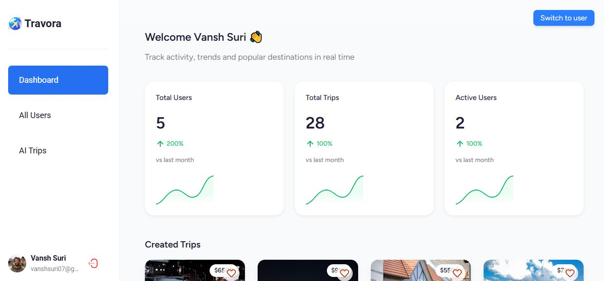
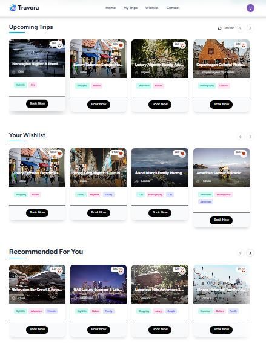
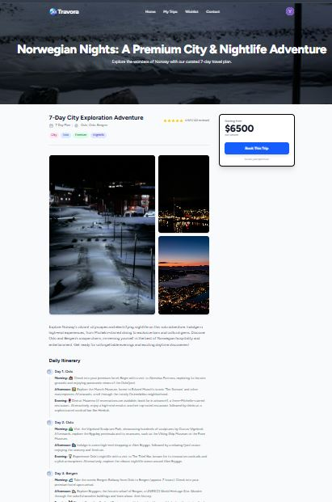

# Travora - Your AI-Powered Travel Companion

<div align="center">
  
  <h1>Travora</h1>
  <p>Your AI-powered travel companion to discover, plan, and book your next adventure.</p>

[](https://your-live-demo-url.com)
[](https://your-build-status-url.com)
[](LICENSE)

</div>

## ✨ Features

- **AI-Powered Recommendations**: Get personalized travel suggestions based on your preferences.
- **Interactive Globe**: Explore destinations on a beautiful 3D globe.
- **Seamless Booking**: Book flights, hotels, and activities with our integrated Stripe payment system.
- **Trip Management**: Organize your itineraries, track your expenses, and manage your bookings all in one place.
- **User Authentication**: Secure sign-up and login functionality.
- **Admin Dashboard**: Manage users, trips, and bookings with a powerful admin dashboard.
- **Responsive Design**: Enjoy a seamless experience on both desktop and mobile devices.

## 📸 Screenshots

<div align="center">
  <table>
    <tr>
      <td></td>
      <td></td>
    </tr>
    <tr>
      <td></td>
      <td></td>
    </tr>
  </table>
</div>

## 🚀 Tech Stack

- **Frontend**: React, React Router, Tailwind CSS
- **Backend**: Appwrite (Backend-as-a-Service)
- **3D Globe**: React Three Fiber, Three.js, React Globe.gl
- **AI**: Google Generative AI
- **Payments**: Stripe

## 🏁 Getting Started

### Prerequisites

- Node.js (v18 or higher)
- npm

### Installation

1. Clone the repository:
   ```bash
   git clone https://github.com/vanshsuri07/travora.git
   ```
2. Install the dependencies:
   ```bash
   npm install
   ```

### Development

Start the development server:

```bash
npm run dev
```

Your application will be available at `http://localhost:5173`.

## 📦 Building for Production

Create a production-ready build:

```bash
npm run build
```

## 🚢 Deployment

### Docker Deployment

To build and run using Docker:

```bash
docker build -t travora .

# Run the container
docker run -p 3000:3000 travora
```

The containerized application can be deployed to any platform that supports Docker, including:

- AWS ECS
- Google Cloud Run
- Azure Container Apps
- Digital Ocean App Platform
- Fly.io
- Railway

### DIY Deployment

If you're familiar with deploying Node applications, the built-in app server is production-ready.

Make sure to deploy the output of `npm run build`:

```
├── package.json
├── package-lock.json
├── build/
│   ├── client/    # Static assets
│   └── server/    # Server-side code
```

## 🤝 Contributing

Contributions are welcome! Please feel free to submit a pull request.

## 📜 License

This project is licensed under the MIT License. See the [LICENSE](LICENSE) file for details.
